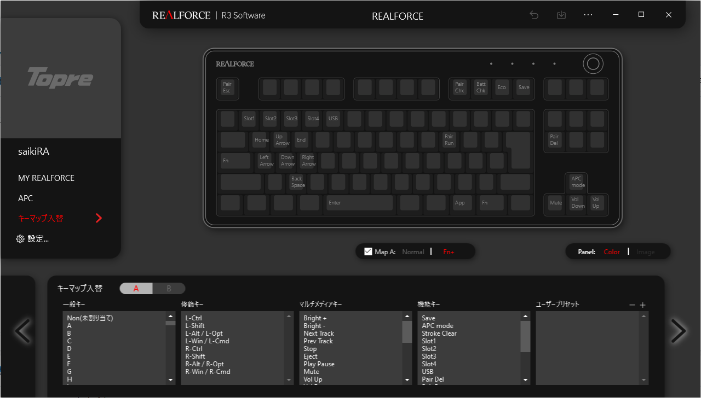

# MyDesk
僕のデスク環境です。

## Desk
### ニトリ デスククーパー120NP-DBR 
引き出し、本棚一体型の学習机です。奥行きが狭いのでどうしてもモニタが顔に近くなってしまいます。ノートPC程度であれば問題ありませんが、27インチのモニタだと目が疲れます。  
本棚部分は天板とネジ止めされていないので、ずらして配置することで足元にもPC本体を置けます。(それでも椅子が入るスペースは無い……)  
早く買い替えたいです。  
販売サイトに参考になる画像がなかったので写真は割愛します。

## Chair
###  EXRACING EX-001-WHITE 
いわゆるゲーミングチェアです。リクライニングの角度が豊富で、完全に横になることも可能です。ただしオットマンが付いていないので、足を伸ばしたい場合は別途土台が必要です。  
アームレストは高さと角度(地面に対して垂直な回転軸)が調整できます。前に使っていた椅子がアメリカンサイズで腰を悪くしたのでこれに変えましたが、特別腰に優しいわけではないです。座り方さえ気をつければ問題ないレベルかと思います。  
ウレタン製のクッションなので座り心地はいいですが、2年間ほぼ毎日使っているとさすがに座っている箇所がへこみクッション性が弱くなりました。椅子として使うだけならまだまだ問題ないですが、座り心地を求めるのであればあまり耐用年数は長くなさそうです。  

Amazon : https://www.amazon.co.jp/gp/product/B089LNN3TG/ref=ppx_yo_dt_b_asin_title_o05_s00?ie=UTF8&psc=1

### ReLarela 足枕【硬めが好きな人専用】 低反発 (幅43cm)
クッションタイプのフットレストです。もともとはゴミ箱に足を乗せていましたが、たまにバランスを崩すので購入しました。  
高さ、角度は調整できません(せいぜい向きを変える程度)。あくまで足置きとしての機能しかありませんが、冬でも冷たくないので気に入っています。  
どうしても椅子、机の高さの整合性を取ろうとすると完全に地面に足がつかない上、太ももが椅子に圧迫されて身体によくない気がするので、フットレストで足の位置を調整するのはおすすめです。  
角度を調整できるタイプもありますが、だいたいプラスチック製なので冬場は冷たくなりそうです。  

Amazon : https://www.amazon.co.jp/gp/product/B08SQNQ74J/ref=ppx_yo_dt_b_asin_title_o08_s00?ie=UTF8&th=1

## Keyboard
### REALFORCE R3 R3HC13
REALFORCE R3のテンキーレス・静音タイプ・30g・有線/無線・JIS配列モデルです。高級キーボードは初めてなのでかなり迷いましたが、結果として買って良かったです。Amazonでたまに5000円引きくらいのセールがやっているので、そのタイミングがおすすめ。  
荷重30gなのでかなり軽いです。なれるまではこれによる打ち間違えもありましたし、いわゆるフェザータッチ(キーを最後まで押し切らないやつ)も難しいですが、3ヶ月くらいでなれました。  
US配列と迷いましたが、WindowsとMacの両方で使用する予定だったので、修飾キーが多くカスタマイズが楽なJIS配列にしました。スペースキーが短く左右の無変換/変換を押しやすいのもポイントです。ただEnterとBackSpaceがホームポジションから遠いのが難点です。今のところそれ以外はすべて気に入っています。  

例として、僕のキー設定を紹介します。

Normalモードでは修飾キー以外変更していません。無変換/変換をIME off/onにしておくと、英語入力と日本語入力を素早く切り替えられるのでおすすめです。(ただ、Windows Terminalを使っているとたまにIMEのデフォルトが半角英数入力になるときがあります……これなんでですかね？IMEはGoogle日本語入力を使っています)  
カタカナ/ひらがなはEscにしておくとvimのモード切替が若干楽になります。でもjjでいいかも……これは好みです。(個人的にjjはjを普通に入力したいときに邪魔になるのでもっといい方法が知りたいです)  
Caps Lockなんか誰も使わないので、Fnキーにしています。これはFnモードのカスタマイズと組み合わせるとホームポジションを崩さずに操作できるので強力です。Caps LockにはLeft-Ctrlを割り当てる宗派もいますが、いまのところこっちの方が気に入っています。  
Fnモードでは、WASDに矢印キーを、QとEにHomeとEndを、XにBackSpace、SpaceにEnterを割り当てています。これによりキー操作が格段に楽になりました。おすすめです。ただ間違えて接続先の切り替えを押してしまうこともあるので、IJKLあたりに矢印キーを持ってきたほうがいいかもしれません。あとCapsの位置のFnを押しながらXを押すのが結構きついので、もうちょっといい方法を模索中。ともかくこれでほとんどホームポジションを崩さずにコーディングできるようになりました。(ちなみにFn+Spaceはほとんど使っていません……)  

Amazon : https://www.amazon.co.jp/gp/product/B09J5152SG/ref=ppx_yo_dt_b_asin_title_o06_s00?ie=UTF8&psc=1

### Faluber 木製リストレスト
リストレスト、アームレスト、パームレストなどと呼ばれるものです。REALFORCE R3は結構厚みのあるキーボードなので、これがないと手首の角度がつらいです。  
木製なので金属製ほど冷たくならない点もうれしいです。長さはREALFORCE R3の矢印キー以外がジャストで収まる程度なので十分でしょう。  

Amazon : https://www.amazon.co.jp/gp/product/B08ZXP3V9B/ref=ppx_yo_dt_b_asin_title_o08_s01?ie=UTF8&th=1

### ARCHISS Keyboard Sleeve Medium
REALFORCE R3 R3HC13がピッタリ入るサイズのキーボードケースです。上記のリストレストやマウスを一緒に運ぶのは難しいです。  
大学にREALFORCE R3を持っていく際に重宝していますが、そもそもREALFORCE自体持ち運びには向かないので、HHKBなどもコンパクトなキーボードの方がいいかも……それか大学用に2個目を購入するかですね。
比較的重量のあるキーボードなので、お金に余裕のある人はキーボードを別々に購入した方が良いです。  

Amazon : https://www.amazon.co.jp/gp/product/B085C1JVMV/ref=ppx_yo_dt_b_asin_title_o04_s00?ie=UTF8&th=1

## Mouse
### Logicool Signature M650MRO
Logicoolの無線静音マウスです。最近(2020/12頃)購入しました。音は静かですし、サイドボタンも付いているので勝手が良いです。難点は、Mサイズでも横幅がスリムなので小指側が浮いてしまいます。両サイドともへこんでいる構造なので、好みがわかれそうです。今までは同じLogicoolの別のモデルを使用していましたが、そちらは小指側が膨らんだ構造になっているので手にフィットしていたのですが。  
Logicool Option+に対応しているので、アプリごとにボタン設定を変更できるなどカスタマイズ性は高いです。また、サイドボタンを押しながらだと横スクロールできたり、ホイールを弾くと高速スクロールされたり、便利な機能が多いです。  
注意点として、ホイールの高速スクロール(SmartWheel)はホイール入力が入っていないので、ゲームなどでホイールの入力にキーコンフィグを割り当てる場合はあまり使えないです。(少なくともNoitaではそうでした)  
サイドボタンのない下位モデル(M550)と、複数端末での同時操作に便利な上位モデル(M750)があります。

Amazon : https://www.amazon.co.jp/gp/product/B09Q5NWP49/ref=ppx_yo_dt_b_asin_title_o00_s00?ie=UTF8&th=1

### Logicool G640r
Logicoolの大型ゲーミングマウスパッドです。ぼくはこの上にキーボード、リストレスト、マウスを置いて使っています(デスクワークではそれでも十分なスペースがあります)。FPSなどをする際はキーボードをずらせばそれなりにスペースが確保できます。悪いのは机の狭さです。  
特別滑りの良いものではないですが(机の方がよく滑る)、僕はこれで満足です。こだわる人にはあまりおすすめできないかもしれません。  

Amazon : https://www.amazon.co.jp/gp/product/B01D45U6GK/ref=ppx_yo_dt_b_asin_title_o08_s00?ie=UTF8&th=1

## Monitor
### Acer VG270Sbmiipfx
27インチ、165Hzのモニタです。画質はフルHDですが、何をするにしてもこれで十分でしょう。32インチまでいくと2Kモニタが欲しくなりそうな印象です。  
付属の脚が結構大きく幅を取るので後述のモニタアームを使用しています。  

Amazon : https://www.amazon.co.jp/gp/product/B08HZ2T1GT/ref=ppx_yo_dt_b_asin_title_o03_s00?ie=UTF8&psc=1

### エルゴトロン LX
高級モニタアームです。いいお値段でした……  
まだ購入して間もないので耐久性などはわかりませんが、エルゴトロン製なのでまぁ大丈夫でしょう。  
アームの姿勢を細かく調整できるので、普通にデスクワークをするときはもちろん、リクライニングして寝転びながら映画を見るときにも使えます。気に入っているので壊れるまで使うかも。  

Amazon : https://www.amazon.co.jp/gp/product/B07Q8TJ2KL/ref=ppx_yo_dt_b_asin_title_o02_s00?ie=UTF8&th=1

## Misc
### Reodoeer ブックスタンド
木製の書見台です。プログラムの写経などをする際にどうしても煩わしかったので購入しました。想像以上にノンストレスになったので驚いています。  
ページ数は、紙の厚さにもよりますが400ページくらいまで入ります。片側だけ押さえつければ十分な場合も多いので、600ページ程度の本には対応できるかと思います。  
注意点として、よく見ずにストッパーを動かすと本を抉ることがあるので気をつけたほうがいいです。

Amazon : https://www.amazon.co.jp/gp/product/B013S2V48I/ref=ppx_yo_dt_b_asin_title_o01_s00?ie=UTF8&psc=1

### Razer Kraken X
ヘッドセットです。密閉感があり、あまり耳が痛くならないので気に入っています。マイクはデフォルトだと結構ノイズが入りますが、RTX Voiceを使用することでほとんど除去できました。  
音響関係のことはよくわからないので、とりあえずこれをリピートしています。

Amazon : https://www.amazon.co.jp/gp/product/B07WNN67FY/ref=ppx_yo_dt_b_asin_title_o01_s00?ie=UTF8&th=1